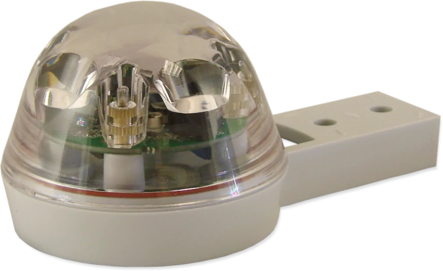
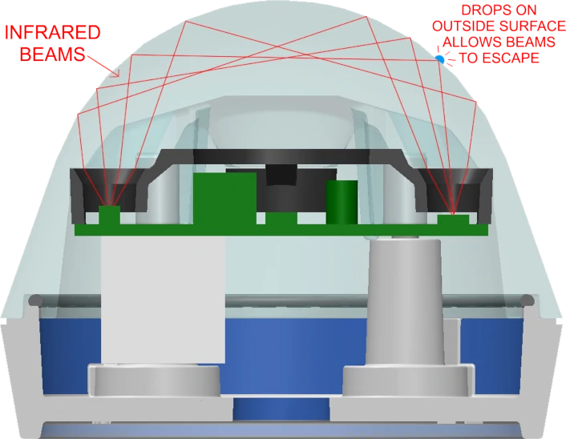
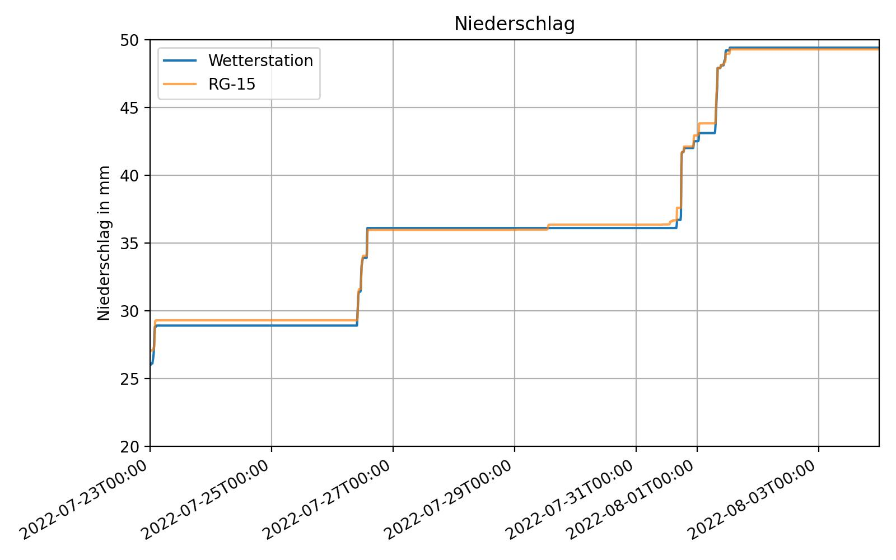
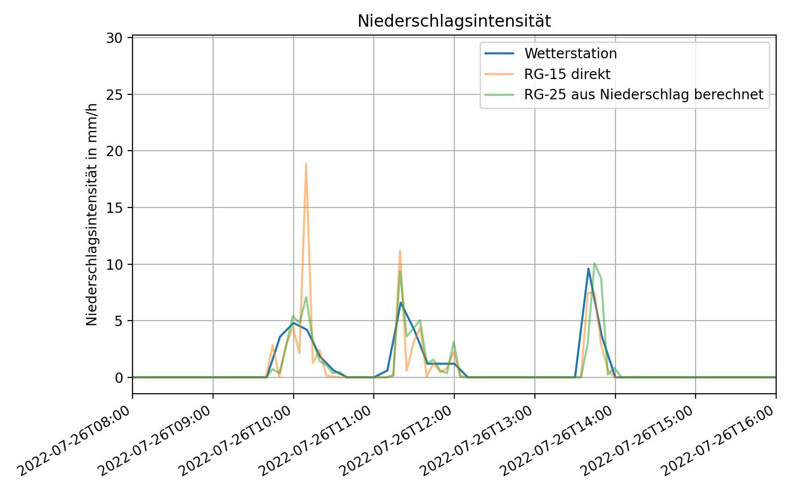

# Zusammefassung und ein paar Plots und Tests zum Regensenor

- Die Auswertung der Sensor Daten im Vergleich zur Wetterstation des ifgi befindet sich im Jupyter Notebook plot.ipynb

## Der Hydreon RG-15 Regensensor

Der **Hydreon RG-15** ist ein Sensor zur Messung von Niederschlag, der entwickelt wurde, um herkömmliche Kippwannen zu ersetzen.

### Funktionsweise
Der **Hydreon RG-15** verwendet Techniken, die für die Steuerung von Regensensor-Windschutzscheibenwischern in der Automobilbranche entwickelt wurden. Er nutzt Infrarotlicht, das durch eine Kunststofflinse auf Detektoren geleitet wird. Wenn Regentropfen die äußere Oberfläche der Linse treffen, entweichen einige der Infrarotstrahlen. Der Sensor erkennt die Veränderung in der Strahlenintensität und bestimmt die Größe des Regentropfens, der die Veränderung verursacht hat.

Die Schaltungstechnik und die digitale Signalverarbeitung erkennen selbst kleinste Regentropfen und unterdrücken die Auswirkungen von Umgebungslicht. Der Sensor erkennt den Zustand der Linsenoberfläche, einschließlich Verschmutzungen, Verunreinigungen, Alterung und anderer Faktoren, und kompensiert diese. Das System kann einzelne Tropfen mit einem Durchmesser von weniger als einem halben Millimeter erkennen und hat eine Genauigkeit von 10%.

(Quelle zum Sensor https://rainsensors.com/products/rg-15/)

### Anwendungen des Regensensors
Der RG-15 kann über die serielle Schnittstelle oder optional über DIP-Schalter konfiguriert werden. Der Stromverbrauch ist sehr gering, wodurch das Gerät gut für solarbetriebene Anwendungen geeignet ist.

In Blockly existiert ein Block, der all diese Einstellungen vornimmt und es ermöglicht, folgende Messwerte auszulesen:

- Gesamtniederschlag in mm
- Niederschlagsintensität in mm/10 min
- Eventniederschlag in mm
- Niederschlag seit dem letzten Neustart in mm

Der Niederschlag bezeichnet jeweils die gemessene Wassermenge pro Fläche seit Beginn der Messung. Dies kann entweder über den gesamten Lebenszeitraum des Sensors (Gesamtniederschlag), seit Beginn des letzten Regenschauers (Eventniederschlag) oder seit dem letzten Neustart sein. Die Einheit mm kann auch als Liter pro Quadratmeter angegeben werden. (Diese Angaben sind äquivalent.)

Die Niederschlagsintensität beschreibt die Änderung der gemessenen Niederschlagsmenge in einem Zeitraum. Dies sind meistens die letzten 10 Minuten. Hierbei berechnet der Sensor nicht einfach die Differenz der Niederschlagswerte, die 10 Minuten auseinander liegen, sondern löst die Änderung in der Zeit deutlich feiner auf, als manche Wetterstationen. Dies führt dazu, dass man immer nur die Niederschlagsintensität eines kurzen Zeitausschnitts ausließt, der nicht dem Mittelewert über 10 Minuten entspricht, auf wenn die Einheit mm/10 Minuten ist. Dies ist im Vergleich weiter Unten zu sehen.

### Vergleich mit Wetterstation
Wir haben die Messwerte des optischen Regensensors mit denen der Wetterstation des Instituts für Geoinformatik der Universität Münster verglichen. In der Summe sind die Niederschlagswerte beinahe identisch. (Dies ist trifft auch auf die über 10 Minuten gemittelten Niederschlagsintensitätswerte zu.)

